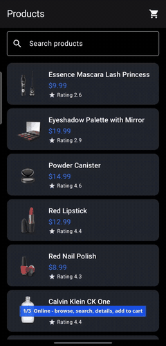
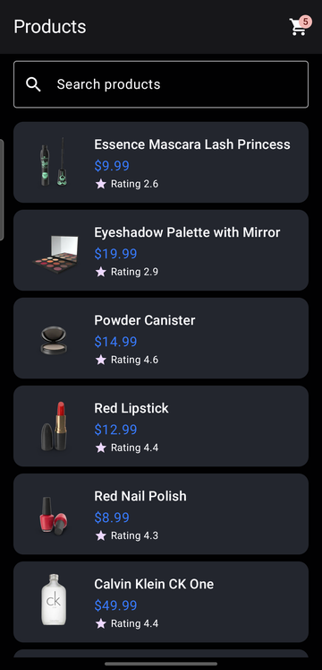
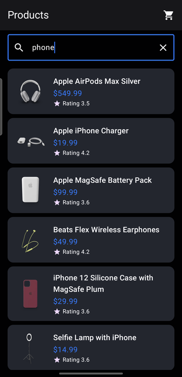
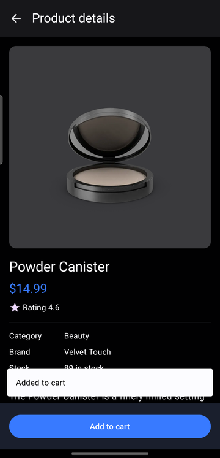
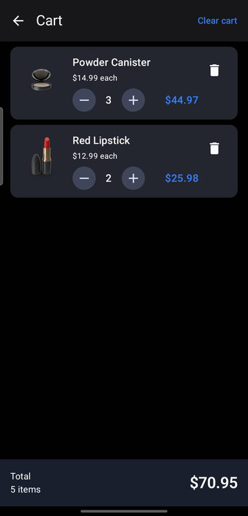
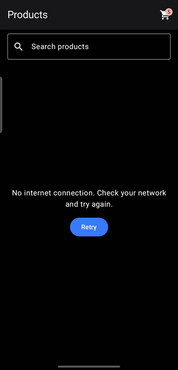
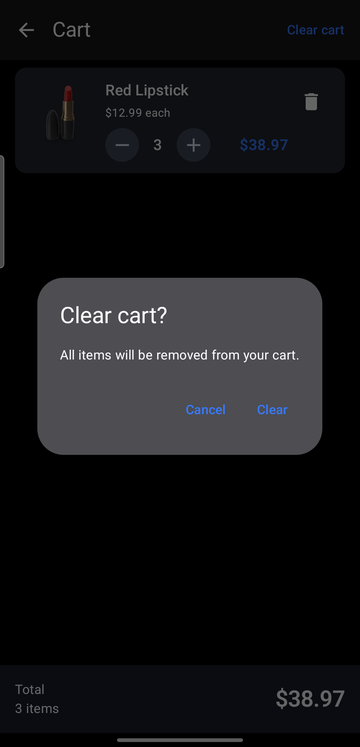
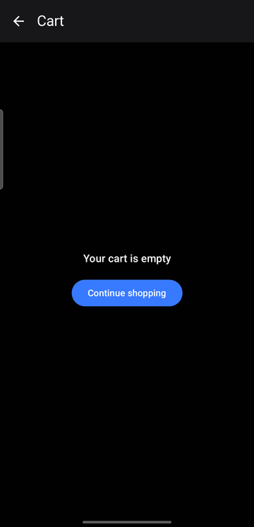

# Product Catalog & Offline Cart

An Android app that browses products from the [DummyJSON Products API](https://dummyjson.com/docs/products) and keeps a **persistent shopping cart that works fully offline**.

Built with Kotlin, Jetpack Compose, MVVM, Coroutines/Flow, Retrofit + OkHttp and Room.

---

## Features

| Area | What it does |
|---|---|
| **Product list** | Image, name, price and rating for each product. Loading, empty, network-error and retry states |
| **Search** | Searches the API as you type (400 ms debounce). Stale requests are cancelled, so only the latest query updates the screen. "No products match “…”" empty state. Retry repeats the current query |
| **Product details** | Large image (with loading/error placeholder), name, price, rating, category, brand (hidden if missing), stock and description. Loading/error/retry states |
| **Add to cart** | From the details screen. A new product is added with quantity 1, an existing one gets +1. Snackbar confirmation; stays on the details screen |
| **Cart** | Thumbnail, title, unit price, quantity stepper (− / +), line total and remove for each row. Total item count, total price, Clear cart (with confirmation), empty state with "Continue shopping" |
| **Cart badge** | Cart icon in the product list's top bar, with the **total quantity** (2 + 3 → `5`) |
| **Offline** | The cart is stored in Room. Opening it, +/−, remove, clear and totals never touch the network and survive app restarts |

---

## Demo video

<a href="docs/demo/product-catalog-demo.mp4"></a>

▶️ **[Full demo video (3 min, MP4)](docs/demo/product-catalog-demo.mp4)**. The preview above runs at 4× speed. Recorded on a real device in three parts:
1. **Online:** browse, search "phone", open details, add to cart (Snackbar), badge count, change quantities in the cart.
2. **Network blocked:** search fails with "No internet connection" + Retry, while the cart still opens and +/− update the totals.
3. **Cold restart while offline:** the cart badge and contents are still there (Room), Clear cart → empty state → Continue shopping. Then the network comes back and Retry loads the products.

---

## Screenshots

Captured on a Samsung Galaxy M35 (Android 16), dark theme.

| Product list + cart badge | Search | Details + add to cart |
|:---:|:---:|:---:|
|  |  |  |

| Cart (offline) | Product list (offline) | Clear cart | Empty cart |
|:---:|:---:|:---:|:---:|
|  |  |  |  |

The offline screenshots were taken after force-stopping and relaunching the app with its network access blocked. The product list shows the error and Retry, while the cart badge, cart contents and totals still come from Room.

---

## Tech stack

| Concern | Library | Version |
|---|---|---|
| Language | Kotlin | 2.2.10 |
| UI | Jetpack Compose, Material 3 | Compose BOM 2024.09.00 (resolves Compose UI 1.11) |
| Navigation | Navigation Compose (type-safe `@Serializable` routes) | 2.10.2 |
| Architecture | AndroidX Lifecycle ViewModel + `collectAsStateWithLifecycle` | 2.11.0 |
| Async | Kotlin Coroutines + Flow | 1.9 |
| Networking | Retrofit + OkHttp + kotlinx.serialization converter | 3.0.0 / 4.12.0 / 1.9.0 |
| Persistence | Room (KSP) | 2.8.5 |
| Images | Coil 3 (`coil-compose`, `coil-network-okhttp`) | 3.3.0 |
| Tests | JUnit 4, kotlinx-coroutines-test, AndroidX Test | — |

No DI framework (Hilt/Koin), no Firebase, no mocking library. Dependencies are wired by hand through a small container.

Build: AGP 9.1.1, Gradle 9.3.1, compileSdk 37, targetSdk 36, minSdk 24.

---

## Architecture

MVVM with a repository layer. Each layer only depends on the layer below it, and the UI only ever sees domain models.

```
┌─────────────────────── UI (Compose) ───────────────────────┐
│ ProductListScreen    ProductDetailScreen    CartScreen     │  stateless, state + callbacks
│        ▲                     ▲                  ▲          │
│ ProductListViewModel ProductDetailViewModel CartViewModel  │  StateFlow UI state, viewModelScope
└────────┬─────────────────────┬──────────────────┬──────────┘
         │                     │                  │
   ProductRepository ◀─────────┘                  │
         │             CartRepository ◀───────────┘ (+ list badge, + details "Add to cart")
         │                     │
     ProductApi             CartDao
  (Retrofit/OkHttp)      (Room / SQLite)
         │                     │
    dummyjson.com        product_catalog.db
```

- **The cart never depends on the network.** `DefaultCartRepository` only takes a `CartDao`. There is no `ProductApi` anywhere in the cart path, so it *can't* make a request.
- **Domain models** (`Product`, `CartItem`) are plain Kotlin. Network DTOs (`ProductDto`) and Room entities (`CartEntity`) are mapped at the data-layer boundary.
- **Manual DI:** `ProductCatalogApplication` owns one `AppContainer` that lazily creates the `NetworkClient`, the Room database and both repositories. ViewModel factories look them up via `CreationExtras`.

### Package structure

```
com.product_catalog_offline_cart
├── ProductCatalogApplication.kt   owns the AppContainer
├── MainActivity.kt                hosts AppNavHost
├── di/            AppContainer (manual dependency container)
├── data/
│   ├── remote/    ProductApi, DTOs, NetworkClient, DTO → domain mapper
│   ├── local/     AppDatabase, CartEntity, CartDao, entity ↔ domain mapper
│   └── repository/ ProductRepository, CartRepository + Default implementations
├── domain/model/  Product, CartItem, cart totals
├── navigation/    type-safe destinations + AppNavHost
└── ui/
    ├── products/  list + search (ViewModel, Screen)
    ├── details/   product details + add to cart
    ├── cart/      cart screen
    ├── common/    shared loading/error UI, error→message mapping, price formatting
    └── theme/
```

---

## Key design decisions

### Offline cart
- **Snapshot on add.** `addToCart(product)` copies everything the cart shows (title, price, thumbnail URL) into Room. After that, every cart operation uses only the product ID and Room.
- **Structured table, no JSON blob:**
  ```sql
  cart_items(product_id INTEGER PRIMARY KEY, title TEXT, price REAL,
             thumbnail_url TEXT, quantity INTEGER, added_at INTEGER)
  ```
  `added_at` keeps items in the order they were added.
- **Atomic quantity updates.** Every change is a single SQL statement, so rapid taps can't lose an update:
  - add = `INSERT OR IGNORE`, then `quantity = quantity + 1` if the row already existed
  - decrease = `quantity = quantity - 1 … WHERE quantity > 1`, otherwise `DELETE`
  The database can never store a quantity of 0 or less.
- **Totals are derived, not stored.** `totalItems()` and `totalPrice()` are computed from the observed list each time, using `BigDecimal` internally so `0.1 × 3` doesn't drift.
- **Reactive:** `CartDao.observeAll()` returns a `Flow`, so the list badge, the cart screen and the details screen stay in sync automatically.

### Search
- Debounce is a `delay(400)` inside a cancellable job. Each keystroke cancels the previous job, so only the last one reaches the network.
- After the request, `ensureActive()` makes sure a superseded request can never overwrite newer results.
- Calls are skipped when nothing would change (trailing spaces, typing then deleting back to the shown query, the same query already in flight).
- Previous results stay visible during the debounce window, so the list doesn't flicker.

### Errors
- Repositories don't catch anything. ViewModels map exceptions to user messages with one shared function:
  - `IOException` → "No internet connection…"
  - `HttpException` → server error
  - anything else → generic message
- `CancellationException` is always rethrown, so leaving a screen or retrying is never shown as an error.

### Navigation
- Type-safe routes: `ProductListDestination`, `ProductDetailDestination(productId: Int)`, `CartDestination`. Only the product **ID** is passed; the details screen loads its own data.
- The product list stays on the back stack, so search text, results and scroll position are kept after visiting details or the cart.
- Double taps are ignored while a transition is running, and Back uses `navigateUp()` so it can never pop the start destination.

---

## Building and running

**Requirements**
- Android Studio (recent, supporting AGP 9.1) with **Android SDK Platform 37** installed.
- JDK 21. The Gradle daemon toolchain is provisioned automatically via the foojay resolver.

```bash
git clone <repo-url>
cd product-catalog-offline-cart

./gradlew assembleDebug          # build the debug APK
./gradlew installDebug           # install on a connected device / emulator
```
Or open the project in Android Studio and run the `app` configuration.

---

## Tests

```bash
./gradlew testDebugUnitTest           # 67 JVM unit tests
./gradlew connectedDebugAndroidTest   # 6 instrumented Room tests (needs a device/emulator)
./gradlew lintDebug
```

| Suite | Tests | Covers |
|---|---|---|
| `ProductListViewModelTest` | 22 | Loading/Success/Empty/Error, retry, debounce, stale-search cancellation, skipped duplicate requests, clearing search, cart badge |
| `ProductDetailViewModelTest` | 13 | Loading/Success/errors, retry, cancellation is never an error, add to cart (new/existing/failure) |
| `CartViewModelTest` | 10 | Observing items, total items/price, +/−/remove/clear, empty state |
| `DefaultCartRepositoryTest` | 12 | Add new/existing, increase/decrease, decrease from 1 removes, never ≤ 0, remove, clear, Flow emissions |
| `CartMapperTest`, `CartTotalsTest`, `ProductMapperTest` | 10 | DTO/entity/domain mapping, totals without floating-point drift |
| `CartDaoTest` (instrumented) | 6 | The real SQL against in-memory SQLite: duplicate insert ignored, ordering, increment/decrement guards, delete/clear, full repository flow |

ViewModel and repository tests use hand-written fakes (`FakeCartRepository`, `FakeCartDao`) and `kotlinx-coroutines-test`. No mocking library.

### Manual offline check
1. Add a few products to the cart while online.
2. Turn on **airplane mode**.
3. Force-stop and reopen the app. The product list shows the network error, but the cart badge is still correct.
4. Open the cart: items, prices and totals are shown, and +, −, remove and Clear cart all work.
5. Force-stop and reopen again. The cart is unchanged.

*Tip for wireless debugging, where airplane mode would drop the adb connection:* on Android 14+, you can cut network access for just this app:
```bash
adb shell cmd connectivity set-chain3-enabled true
adb shell cmd connectivity set-package-networking-enabled false com.product_catalog_offline_cart
# … test …
adb shell cmd connectivity set-package-networking-enabled true com.product_catalog_offline_cart
adb shell cmd connectivity set-chain3-enabled false
```

---

## Known limitations

- **Thumbnails offline:** cart images load from the stored URL through Coil's cache. An image that was never cached shows a placeholder; text, prices, quantities and totals are unaffected.
- **Price snapshot:** the cart keeps the price from when the item was added; it isn't refreshed from the API.
- **No stock validation** on "+", and the product list/search isn't cached offline. Both are outside the assignment scope.
- A 404 for a product ID shows the generic server error rather than a specific "product not found" message.
- Dependencies are pinned to versions compatible with Kotlin 2.2 (e.g. Coil 3.3, kotlinx.serialization 1.9). Newer releases require Kotlin 2.3/2.4.

## Possible next steps

- Cache the product list in Room for offline browsing (offline-first catalog).
- Paging for the full catalog (`limit`/`skip`).
- Compose UI tests for the main flows, and MockWebServer tests for `ProductApi`.
- Room schema export + migrations once the schema evolves.
